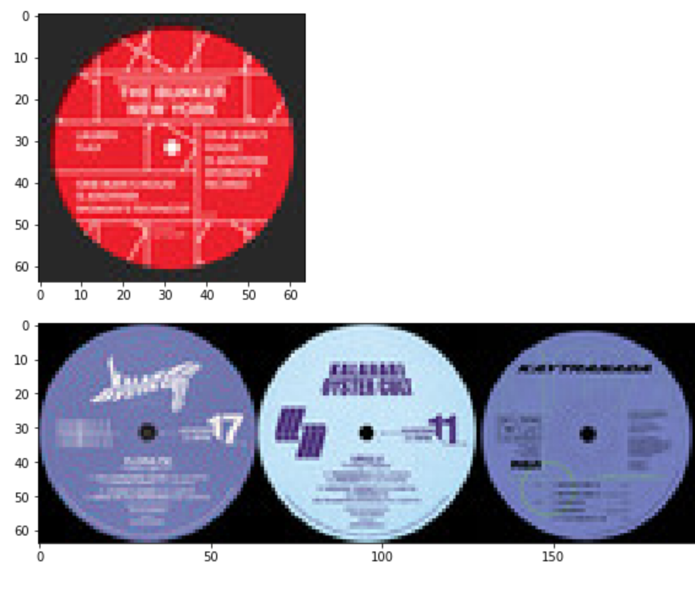

# Album Artwork Recommendation
A huge part of my music choices stem from the album cover. For me a good album cover augments the listening experience greatly, and is usually the first thing I look at when out hunting for new music.
 
 
Historically speaking, the album cover has been a marketing tool for record
companies and artists to sell music. As streaming platforms and online music services have grown in size, the utility of the album cover has diminished. From a personal standpoint, I am always looking for music that fits my tastes sonically and visually. While services like Spotify have great recommendation engines in place to serve the former, there isn't anything readily available to serve the latter.
 
 
As a quick test, I decided to create a program that could recommend you albums with similar visual aesthetics based on an queried album. There are three different scripts on this repo, one for scraping albums, extracting features, and recommending new albums.

 
 

## Setup
You'll need some standard dependancies which you can find in the requirements.txt. Additionally you'll need to register an app within the Spotify API in order to scrape albums.
 
 
If you wish to download your own set of album covers. Feel free to paste your own Spotify URI's into the album scraper script. You'll need to run the feature extraction script as well and save a new pca features vector in order to get the correct recommendations.
 
 
If you just want to use the images I've collected, you can just unzip the .zip file included in the repo. 
